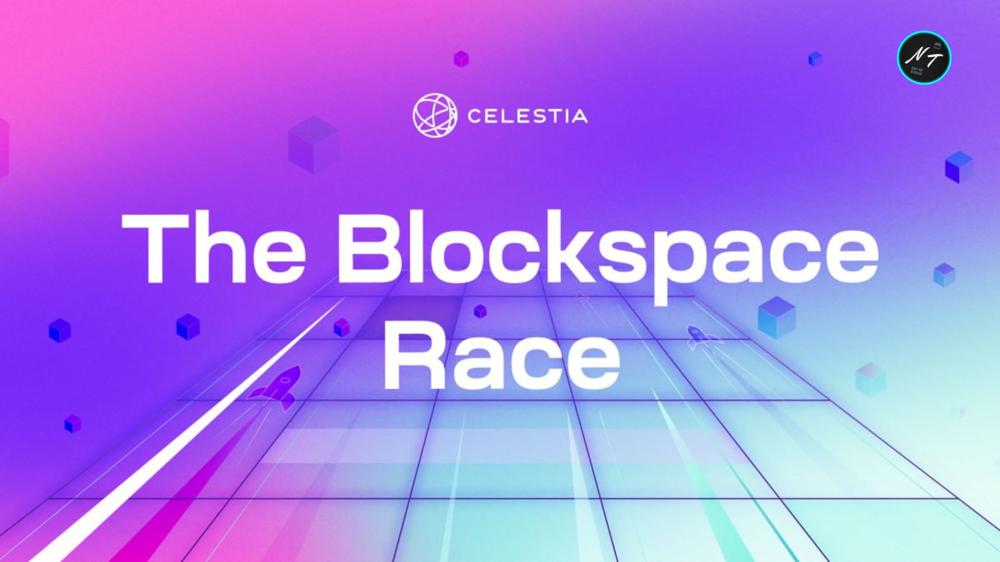

# Celestia-PayForBlob

This is an example of Keplr extension that injects the cosmJS compatible offline signer.

In addition, the user will enter values through the UI and the PlayForBlob operation will be performed on the backend.

## __Requirements__
Install dependencies
First, you must set up Celestia Node.
You can view https://docs.celestia.org/developers/node-tutorial/ for node or video tutorial here. <https://www.youtube.com/channel/UC6ndYQW9mjsgOpz_hr95yEA> 
