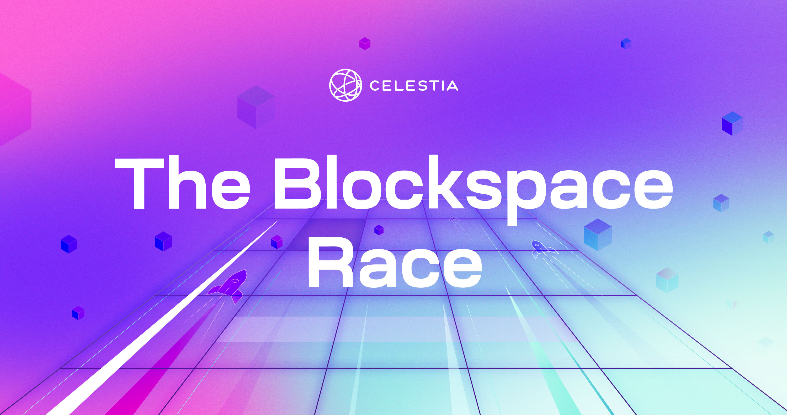

# Celestia-PayForBlob

This is an example of Keplr extension that injects the cosmJS compatible offline signer.

In addition, the user will enter values through the UI and the PlayForBlob operation will be performed on the backend.



## __Requirements__

First, you must set up Celestia Node.

You can view https://docs.celestia.org/developers/node-tutorial/ for setting up a node

And video tutorial here. <https://www.youtube.com/channel/UC6ndYQW9mjsgOpz_hr95yEA> 

**Install dependencies**

```
npm install
npm install --save-dev webpack
```

**For Cors Policy Error**
<https://www.npmjs.com/package/local-cors-proxy> 
```
npm install -g local-cors-proxy
```
API endpoint that we want to request that has CORS issues:
```
http://localhost:26659
```
Start Proxy:
```
lcp --proxyUrl http://localhost:26659
```
Then in your client code, new API endpoint:
```
http://localhost:8010/proxy/
```
End result will be a request to http://localhost:26659 without the CORS issues!

For other commands see comments on src/main.js 

### __Note__
This is my first ui work and code design in blockchain.
I may have installed extra, missing or unnecessary packages. 
UI can connect with your Keplr wallet, but cannot sign the submit transaction on the network and broadcast it now.
You can support main.js or elsewhere for development.
Thanks


